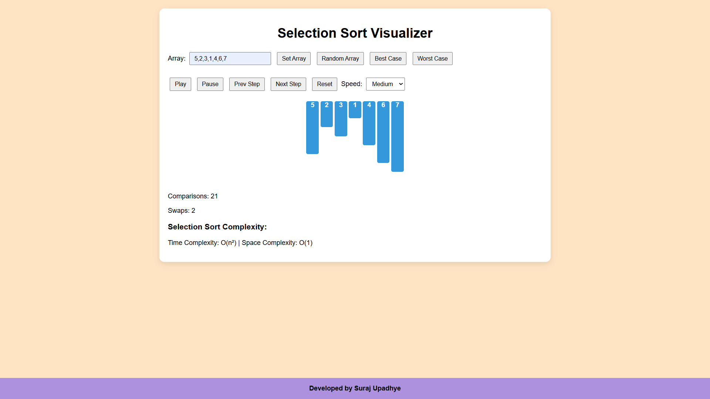
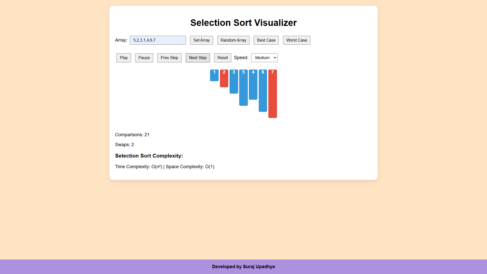
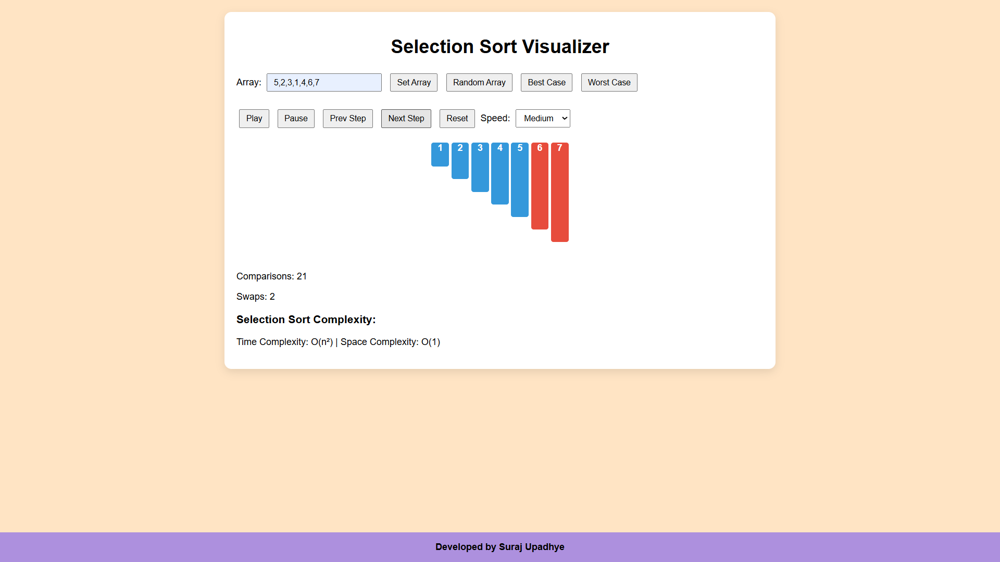
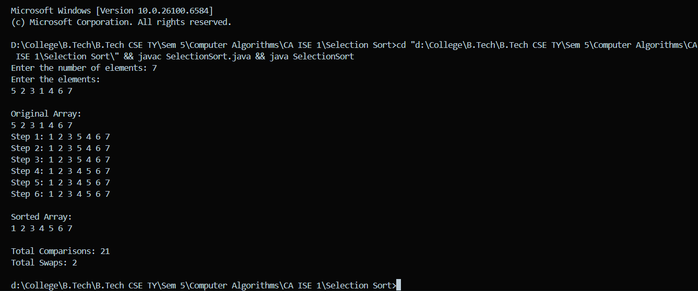

# Selection Sort Visualizer

## Project Overview

This project implements **Selection Sort** with an **interactive, step-by-step visualization** using HTML, CSS, and JavaScript. The purpose of this project is to help students understand how Selection Sort works internally, including comparisons, swaps, and the array state at each step.

### Features

- Step-by-step visualization of the Selection Sort kalgorithm
- Highlights for comparisons (red) and swaps (green)
- Controls:
  - Play / Pause
  - Step Forward / Step Backward
  - Reset
  - Adjustable speed (Slow, Medium, Fast)
- Array input options:
  - User-defined
  - Random
  - Preset (Best/Worst case)
- Real-time display of:
  - Number of comparisons
  - Number of swaps
- Complexity notes:
  - Time Complexity: O(n²)
  - Space Complexity: O(1)

---

## Project Structure

- `index.html` # Main HTML file
- `style.css` # CSS styling
- `script.js` # JavaScript logic and visualization
- `SelectionSort.java` # Console-based visualization
- `README.md` # Project documentation
- `Screenshots/` # Folder containing screenshots of visualizer

---

## How to Run

### Option 1: Open in Browser (Recommended)

1. Download or clone the project folder.
2. Open `index.html` in any modern web browser (Chrome, Firefox, Edge).
3. Use the controls to:
   - Input a custom array
   - Generate a random array
   - Use preset arrays (best/worst case)
   - Play, pause, step forward/backward, or reset the visualization
4. Observe the array bars and statistics (comparisons, swaps) updating in real-time.

### Option 2: Java Console Version

1. Open `SelectionSort.java` in any Java IDE or compile via command line.
2. Compile the program:

   ```java
   javac SelectionSort.java
   ```

3. Run the program:

   ```java
   java SelectionSort
   ```

4. Enter array size and elements when prompted.
5. Observe the array at each step, along with total comparisons and swaps.

---

## Controls in Visualization

| Control        | Function                                |
| -------------- | --------------------------------------- |
| Play           | Automatically steps through the sorting |
| Pause          | Pauses automatic execution              |
| Next Step      | Move forward by one step                |
| Previous Step  | Move backward by one step               |
| Reset          | Reset array to initial state            |
| Speed Selector | Choose Slow / Medium / Fast execution   |

---

## Complexity

- **Time Complexity:**
  - Best Case: O(n²)
  - Worst Case: O(n²)
  - Average Case: O(n²)
- **Space Complexity:** O(1) (in-place sorting)

---

## Screenshots

1. Home Page of Selection Sort Visualizer  
   

2. Initial Array Input  
   

3. Stepwise Visualization  
   

4. Final Sorted Array  
   

5. Console Based Visualization Output\
   

---

## Live Demo

You can try the Selection Sort Visualizer online at:\
Selection Sort Visualizer: https://Suraj-Upadhye.github.io/Selection-Sort-Visualizer

## Author

**[Suraj Upadhye](https://www.github.com/Suraj-Upadhye)**\
Computer Algorithms (7CS203) – AY 2025-2026
